# Gaming Profiles 2025: Database Project

### Xbox Gaming Data

* **Name:** Jak
* **Course:** Database for Analytics
* **Project:** Gaming Profiles 2025
* **Database:** `Video Games`
* **Tools Used:** PostgreSQL, pgAdmin, DrawDB, GitHub
* **Programming Language:** SQL

---

## 1. Initial Data Source

### Overview

* Original data source:** [Gaming Profiles 2025 (Steam, PlayStation, Xbox)]
* Dataset URL:** [https://www.kaggle.com/datasets/artyomkruglov/gaming-profiles-2025-steam-playstation-xbox/data?select=xbox]
* File format:** [CSVs]
* Subject:** Xbox players gaming information

### Description

[I selected this data because, as a gamer myself, I wanted to find a dataset I was personally interested in. The dataset included information on Steam, PlayStation, and Xbox players. I chose Xbox because although I have a PlayStation now, I had more enjoyable gaming experiences on Xbox.]

---

## 2. Data Format and Dataset Size

The original data was loaded into PostgreSQL and organized into six tables.

### Dataset Overview

| Attribute                  | Description         |
| -------------------------- | ------------------- |
| Original file format       | [CSV]               |
| Database format            | Relational database |
| Database management system | PostgreSQL          |
| Number of tables           | 6                   |
| Total number of rows       | [15275900]          |
| Total number of columns    | [26]                |

### 2.1Row Counts

```sql
SELECT COUNT(*) AS row_count FROM players;
SELECT COUNT(*) AS row_count FROM games;
SELECT COUNT(*) AS row_count FROM achievements;
SELECT COUNT(*) AS row_count FROM prices;
SELECT COUNT(*) AS row_count FROM purchased_games;
SELECT COUNT(*) AS row_count FROM history;
```

### 2.2 Column Counts

```sql
SELECT
    table_name,
    COUNT(*) AS column_count
FROM information_schema.columns
WHERE table_schema = 'public'
  AND table_name IN (
      'players',
      'games',
      'achievements',
      'prices',
      'purchased_games',
      'history'
  )
GROUP BY table_name
ORDER BY table_name;
```

| Table           |    Num.Rows     |   Num.Columns|
| --------------- | -------------: | -----------:|
| players         |     [274450]   |     [5]     |
| games           |     [10489]    |     [7]     |
| achievements    |     [351111]   |     [3]     |
| prices          |     [22638]    |     [2]     |
| purchased_games |     [11656184] |     [7]     |
| history         |     [15275900] |     [2]     |

### Screenshot

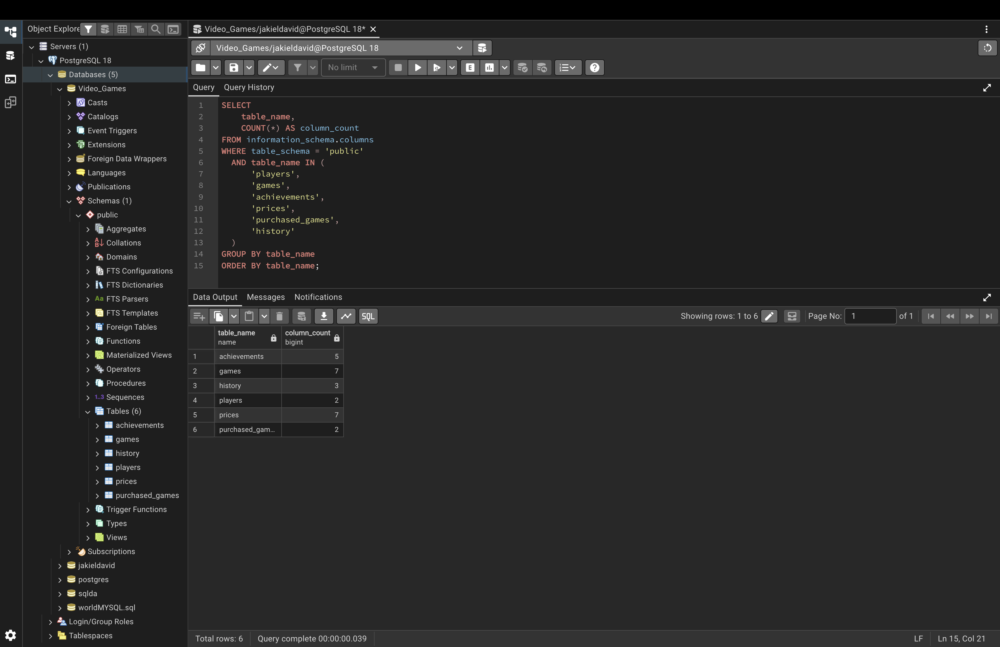

---

## 3. Data Dictionary

The schema xbox contains:
achievements - achievements available in each game
games - a list of games with general information (title, publisher, genre, etc.)
history - user gaming activity for 2008–2025
players - a list of Xbox users
prices - price history for each game in 5 different currencies
purchased_games - a list of games purchased by each user

The following queries display the columns, data types, each table.

```sql
SELECT
    table_name,
    ordinal_position,
    column_name,
    data_type
FROM information_schema.columns
WHERE table_schema = 'public'
  AND table_name IN (
      'players',
      'games',
      'achievements',
      'prices',
      'purchased_games',
      'history'
  )
ORDER BY table_name, ordinal_position;
```

### Screenshot

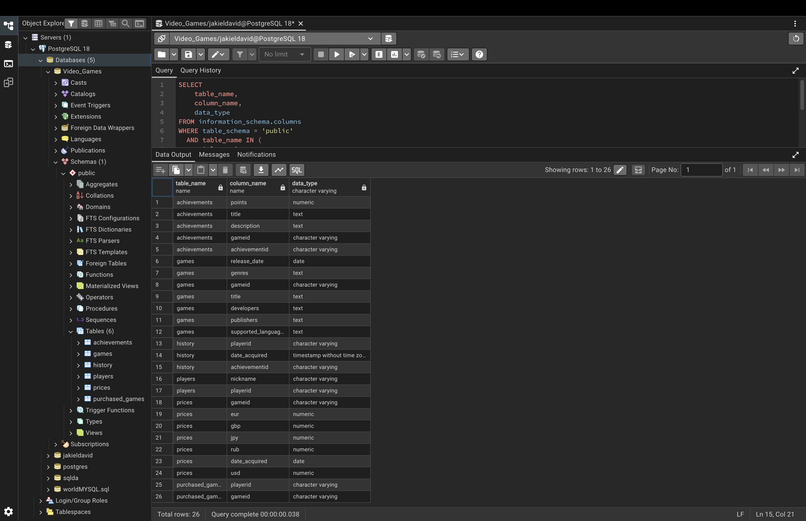

---

## 4. Data Transformation and Challenges

### Challenge 1: Selecting a Dataset


### Challenge 2: Loading the Data

[Describe any challenges importing the source data into PostgreSQL.]

**Solution:**

[Explain how you resolved the import or loading problems.]

### Challenge 3: Data Quality and Data Types

[Describe any issues with missing values, duplicates, inconsistent data types, or date formats.]

**Solution:**

[Explain how you addressed these issues using SQL or other tools.]


---

## 5. Table Structure and Data Types

### Screenshot

VideoGame data base structure and relationships

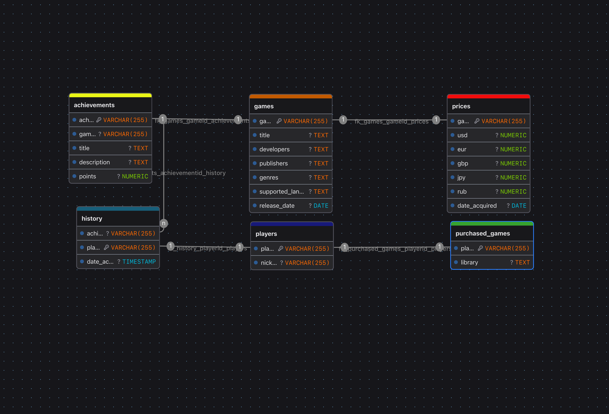
---

## 6. Displaying All Tables

The following SQL statements retrieve all columns and records from each table.

### 6.1 Players

```sql
Select * from players;
```

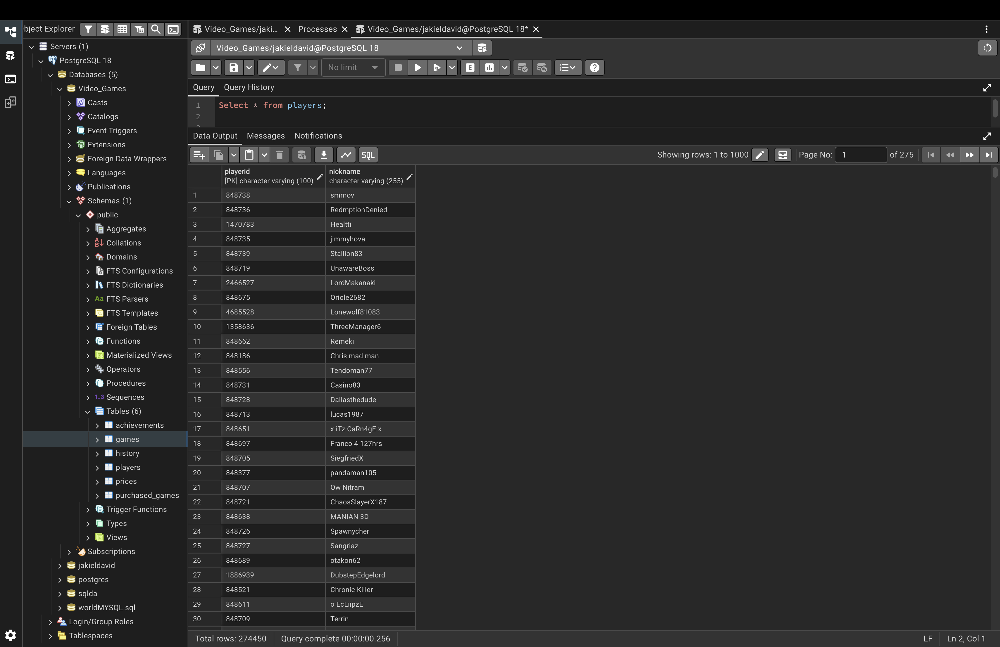

### 6.2 Games

```sql
Select * from games;
```

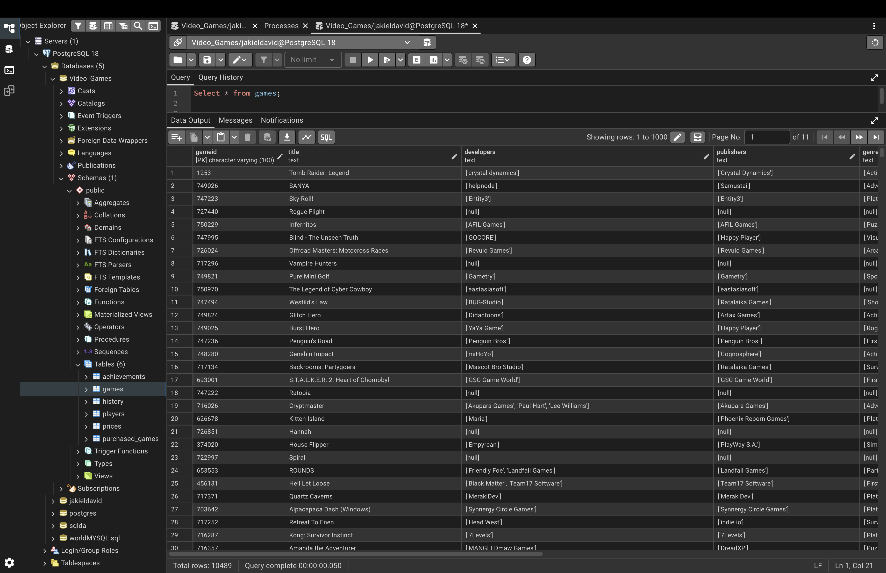

### 6.3 Achievements

```sql
Select * from achievements;
```

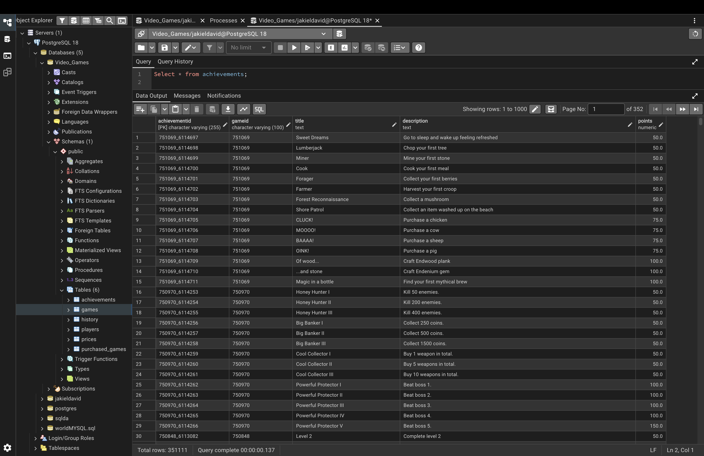

### 6.4 Prices

```sql
Select * from prices;
```

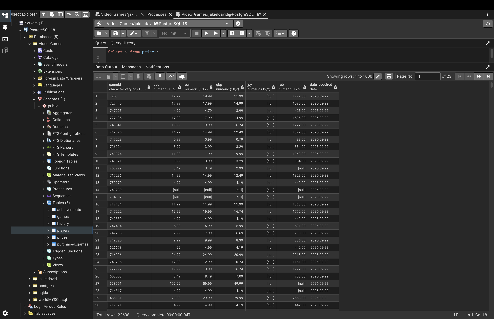

### 6.5 Purchased Games

```sql
Select * from purchased_games;
```

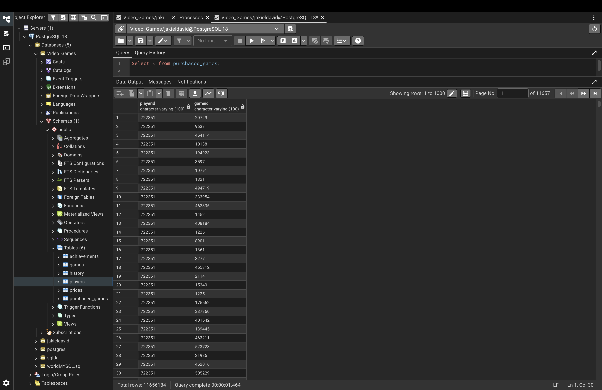

### 6.6 History

```sql
Select * from history;
```

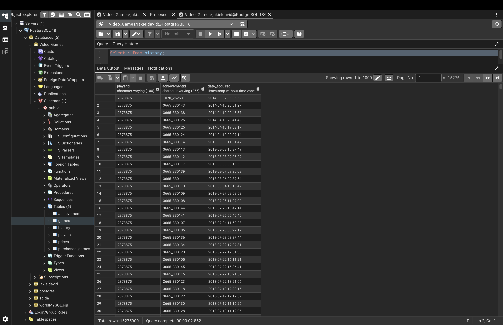

---

## 7. SQL Queries and Analysis

### 7.1 Which developers produced the most games.

```sql
SELECT
    developers,
    COUNT(gameid) AS total_games_produced
FROM games
WHERE developers IS NOT NULL
GROUP BY developers
ORDER BY total_games_produced DESC
LIMIT 20;
```

**Results and Interpretation**
SNK and Hamster Corporation produced the highest number of games at 127. Ubisoft follows in second place with 68 games, and EpiXR Games ranks third with 57. SNK and Hamster represent a significant outlier in this dataset, producing nearly double the volume of the runner-up. This discrepancy is largely because their catalog consists of classic arcade game ports for modern consoles, whereas developers like Ubisoft and EpiXR primarily build new titles.
### Screenshot


### 7.2 Players with most achievement points
```sql
SELECT
    p.nickname,
    SUM(a.points) AS total_achievement_points
FROM players p
JOIN history h ON p.playerid = h.playerid
JOIN achievements a ON h.achievementid = a.achievementid
GROUP BY p.nickname
ORDER BY total_achievement_points DESC
LIMIT 20;
```

**Results and Interpretation**

"Five1oh" is the gamertag (or online account name) for the player with the most points. They have 4,190,043. "Sangriaz" is right behind them in the 4 million point range with 4,110,485. Those are the only two players to break 4 million.

### Screenshot


### 7.3 How many game have they purchased?

```sql
SELECT
    p.nickname,
    COUNT(pg.gameid) AS total_games_purchased
FROM players p
JOIN purchased_games pg ON p.playerid = pg.playerid
WHERE p.nickname IN ('Five1oh', 'Sangriaz')
GROUP BY p.nickname;
```

Five1og bought 4430 games and Sangriaz 4968 games.

### Screenshot

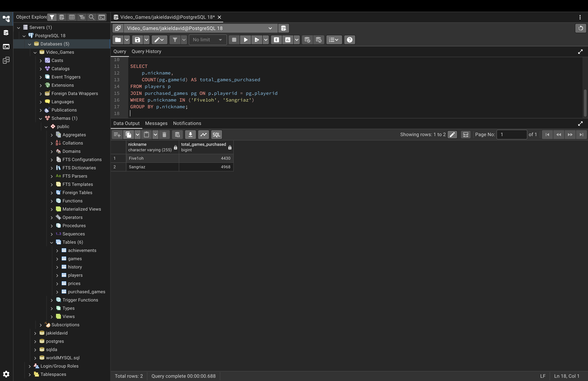

```sql
SELECT
    p.nickname,
    COUNT(pg.gameid) AS total_games_purchased,
    SUM(pr.usd) AS total_spent_usd
FROM players p
JOIN purchased_games pg ON p.playerid = pg.playerid
JOIN prices pr ON pg.gameid = pr.gameid
GROUP BY p.nickname
ORDER BY total_games_purchased DESC
LIMIT 20;
```

When looking at who purchased the most games in total, only Sangriaz is in the top 20. There are other players who bought almost double that amount, but they don't have high achievement scores. It could be that they purchase older games without achievements, or they simply don't complete the games they buy.

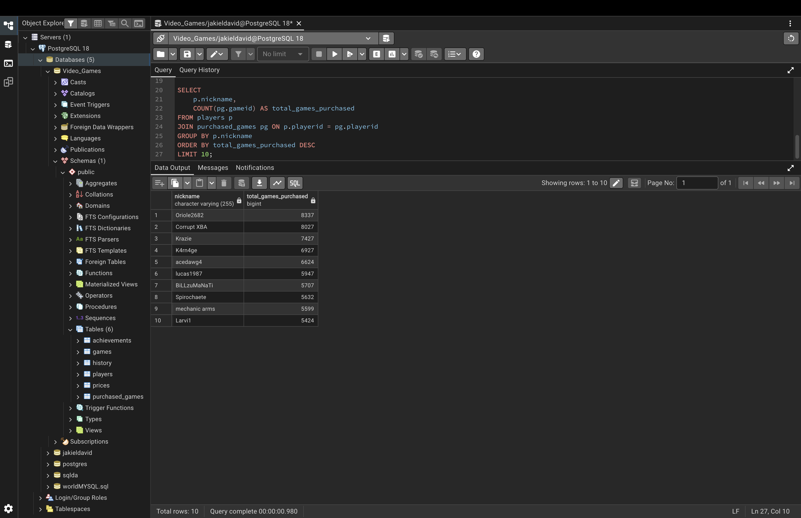

### 7.4 Game Prices in US Dollars

```sql
SELECT
    g.gameid,
    g.title AS game_title,
    p.usd
FROM games AS g
INNER JOIN prices AS p
    ON g.gameid = p.gameid
WHERE p.usd IS NOT NULL
ORDER BY p.usd DESC;
```

**Results and Interpretation**

"Most games are $69.99 for the standard edition, though they also have different editions that cost more. In this dataset's list of standard edition games, the highest-priced title is S.T.A.L.K.E.R. 2 at $109.99 USD."

### Screenshot

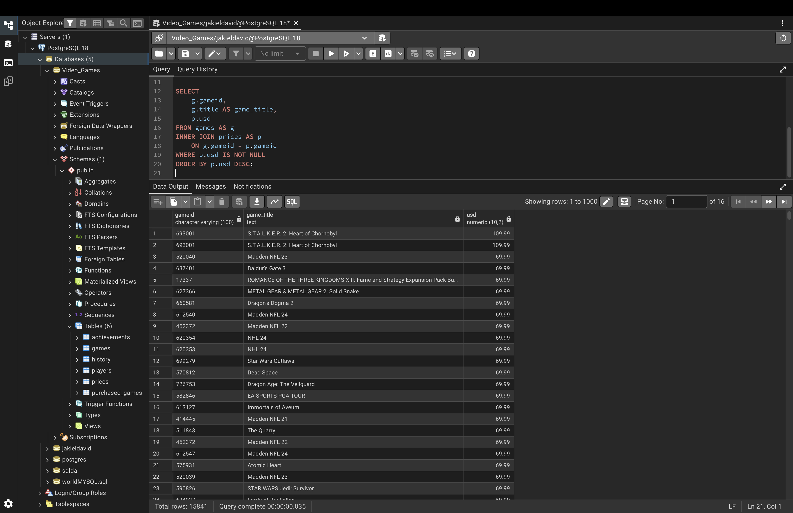


---
