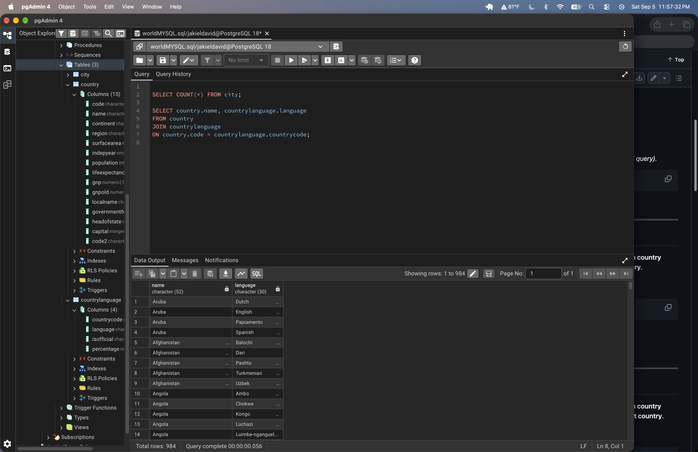
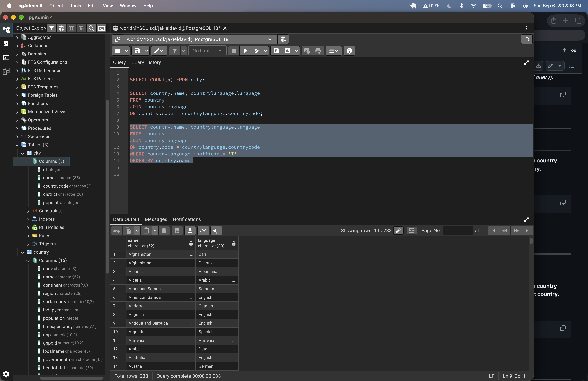
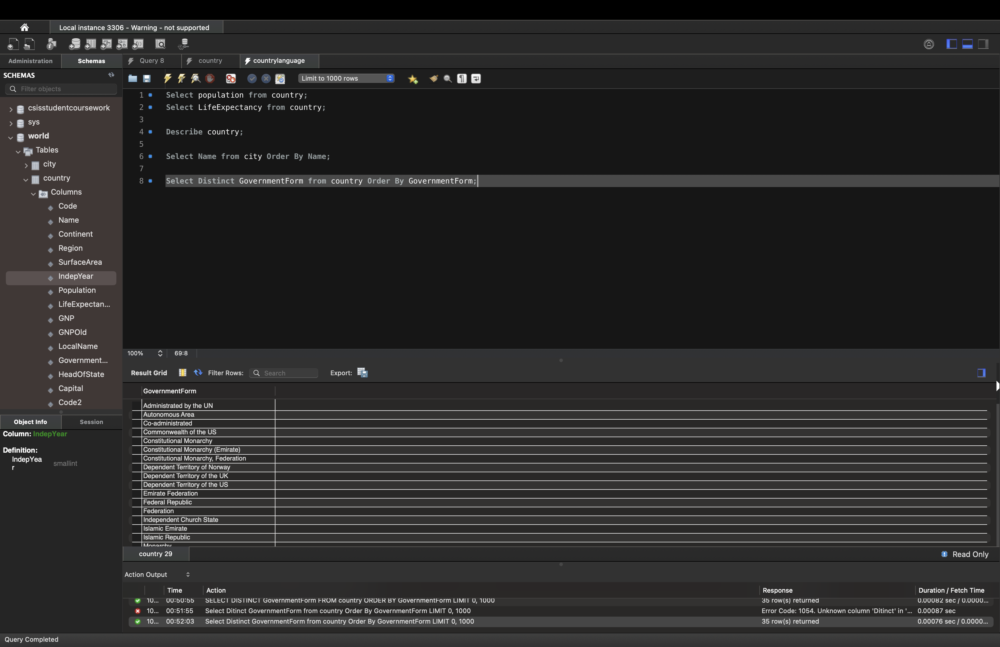
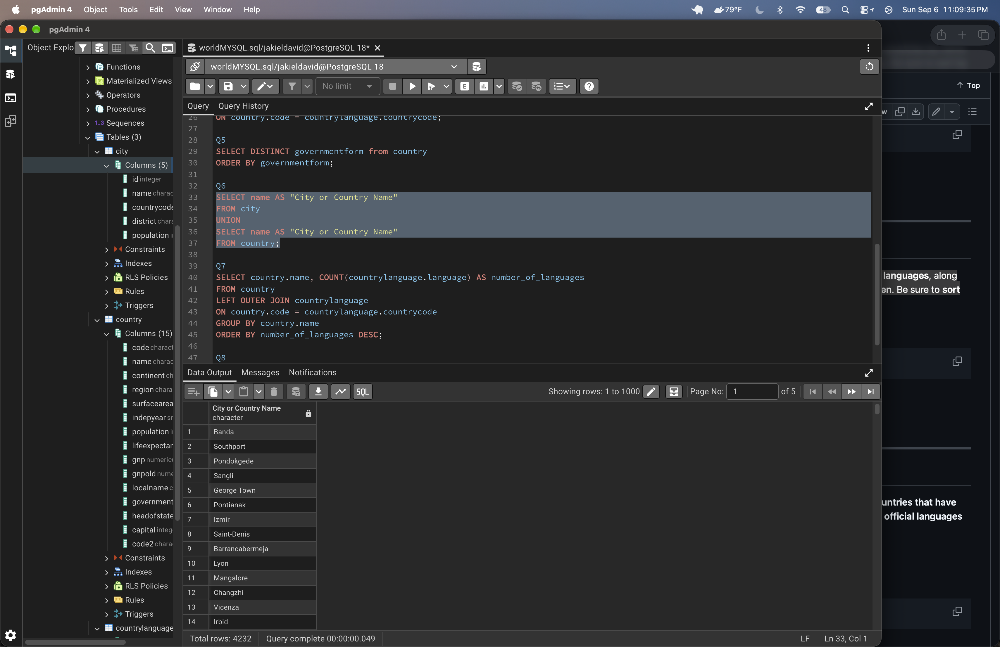
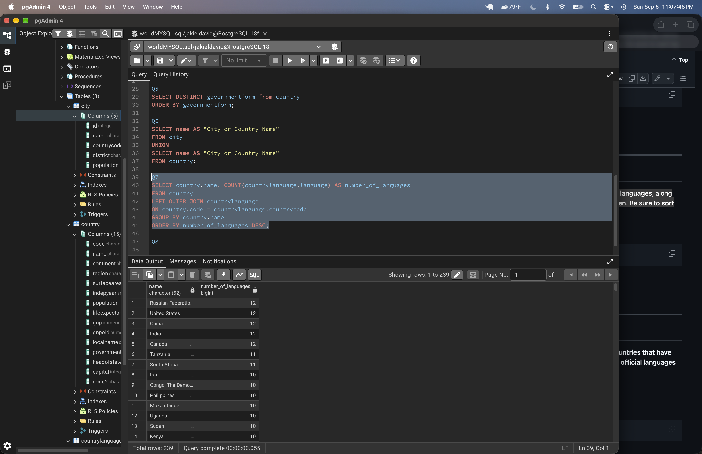
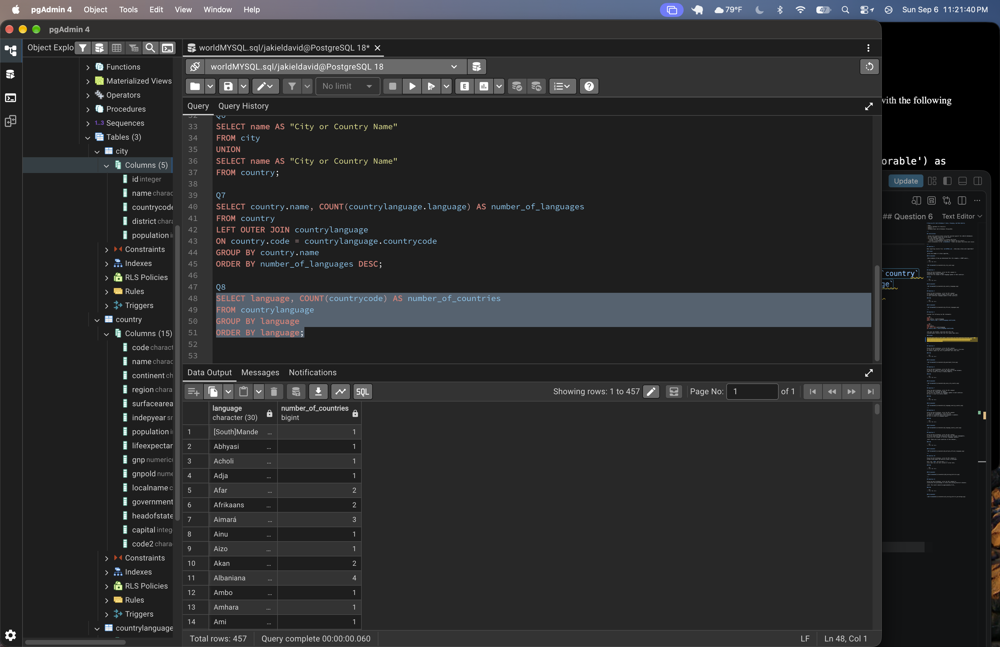
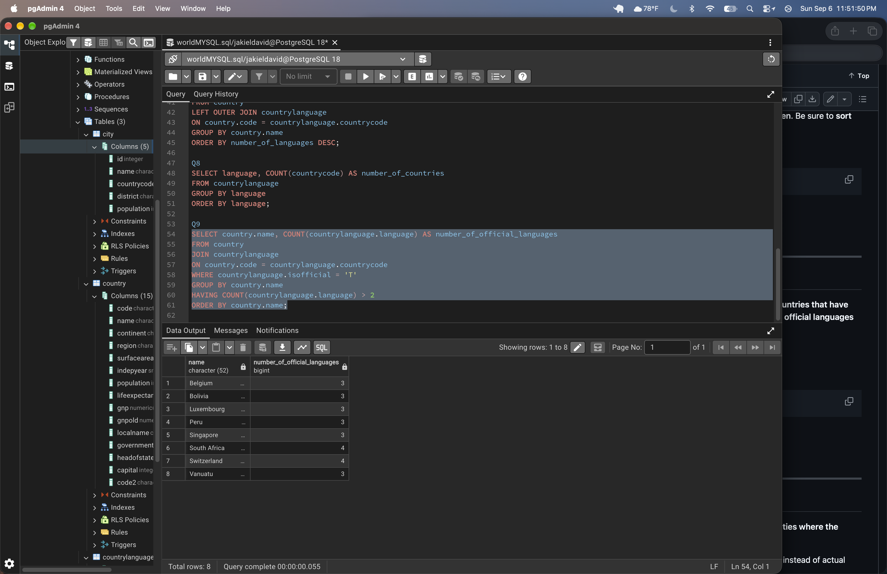
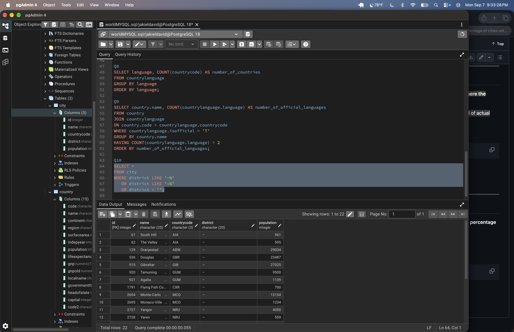
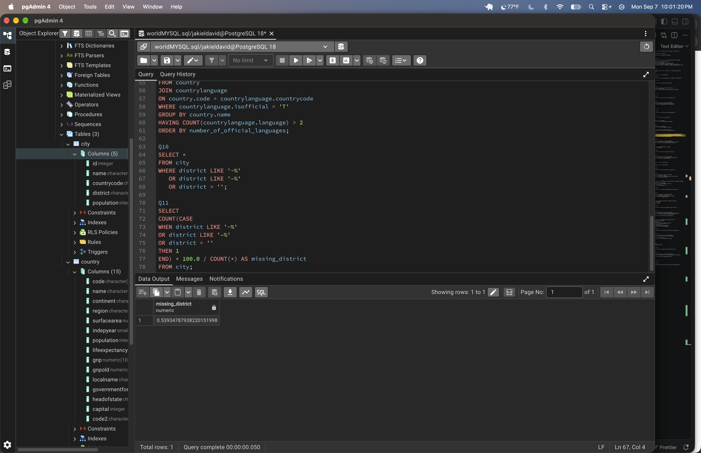

# Exercise 02: World Database – Joins, Grouping, and Data Quality

- Name:Jak
- Course: Database for Analytics
- Module: 2
- Database Used: World Database (PostgreSQL)

---

## Instructions

- Answer each question below using SQL executed against the **World database**.
- All SQL commands **must be run by you**.
- For each SQL-based question:
  - Include the SQL command in a fenced code block
  - Include a **screenshot** showing the command and its results
- Store screenshots in the `screenshots/` folder and embed them below each answer.

---

## Question 1

When importing records from `worldPGSQL.sql`, **how many cities were imported**?

### Answer

_Write the number of cities imported._

### Screenshot

_Show evidence of how you determined this (for example, a COUNT query)._

```sql
SELECT COUNT(*) FROM city;
```


---

## Question 2

Using the World database, write the SQL command to
**display each country name**
along with the **name of each language spoken in that country**.

### SQL

```sql
SELECT country.name, countrylanguage.language
FROM country
JOIN countrylanguage
ON country.code = countrylanguage.countrycode;
```

### Screenshot



---

## Question 3

Using the World database, write the SQL command
to **display each country name** along with the name
of each **official language spoken in that country**.

### SQL

```sql
SELECT country.name, countrylanguage.language
FROM country
JOIN countrylanguage
ON country.code = countrylanguage.countrycode
WHERE countrylanguage.isofficial= 'T'
ORDER BY country.name;
```

### Screenshot



---

## Question 4

Consider the following two SQL statements:

```sql
SELECT *
FROM country, countrylanguage
WHERE country.code = countrylanguage.countrycode;
```

```sql
SELECT *
FROM country
LEFT OUTER JOIN countrylanguage
ON country.code = countrylanguage.countrycode;
```

**In your own words**, describe what data the
**second query returns that the first query does not**.

### Answer

The 2nd query uses a `LEFT JOIN`, which shows all the countries from the `country` table, even if they don't have matching information in the `countrylanguage` table. Whereas, the 1st query only shows the countries that have matching information in both tables.

---

## Question 5

Using the World database, write the SQL command
to **list all different forms of government** found in the data.
Do **not** repeat any form of government more than once.

### SQL

```sql
SELECT DISTINCT governmentform from country
ORDER BY governmentform;
```

### Screenshot



---

## Question 6

Using the World database, write the SQL command
to **list all names of cities and countries in one column**.
Label the column **"City or Country Name"**.

### SQL

```sql
SELECT name AS "City or Country Name"
FROM city
UNION
SELECT name AS "City or Country Name"
FROM country;
```

### Screenshot



---

## Question 7

Using the World database, write the SQL command
to **list all countries by name**,
along with the **number of languages spoken in each country**.
Be sure to **sort by country name**.

### SQL

```sql
SELECT country.name, COUNT(countrylanguage.language) AS number_of_languages
FROM country
LEFT OUTER JOIN countrylanguage
ON country.code = countrylanguage.countrycode
GROUP BY country.name
ORDER BY number_of_languages DESC;
```

### Screenshot



---

## Question 8

Using the World database, write the SQL command
to **list all languages**, along with the
**number of countries where each language is spoken**.
Be sure to **sort by language name**.

### SQL

```sql
SELECT language, COUNT(countrycode) AS number_of_countries
FROM countrylanguage
GROUP BY language
ORDER BY language;
```

### Screenshot



---

## Question 9

Using the World database, write the SQL command
to **list countries that have more than two official languages**,
along with the **number of official languages spoken**.

_Hint: There are 8 such countries in this dataset._

### SQL

```sql
SELECT country.name, COUNT(countrylanguage.language) AS number_of_official_languages
FROM country
JOIN countrylanguage
ON country.code = countrylanguage.countrycode
WHERE countrylanguage.isofficial = 'T'
GROUP BY country.name
HAVING COUNT(countrylanguage.language) > 2
ORDER BY number_of_official_languages;
```

### Screenshot



---

## Question 10

Using the World database, write the SQL command to
**find cities where the district value is missing**.

Hint: Use `LIKE` and the dash (`-`)
since some rows use that instead of actual data.

### SQL

```sql
SELECT *
FROM city
WHERE district LIKE '-%'
   OR district LIKE '–%';
```

### Screenshot



---

## Question 11

Using the World database, write the SQL command to
**calculate the percentage of cities with missing district values**.

_Hint: The result should be approximately 0.4%._

### SQL

```sql
SELECT
COUNT(CASE
WHEN district LIKE '-%'
OR district LIKE '–%'
OR district = ''
THEN 1
END) * 100.0 / COUNT(*) AS missing_district
FROM city;
```

### Screenshot


