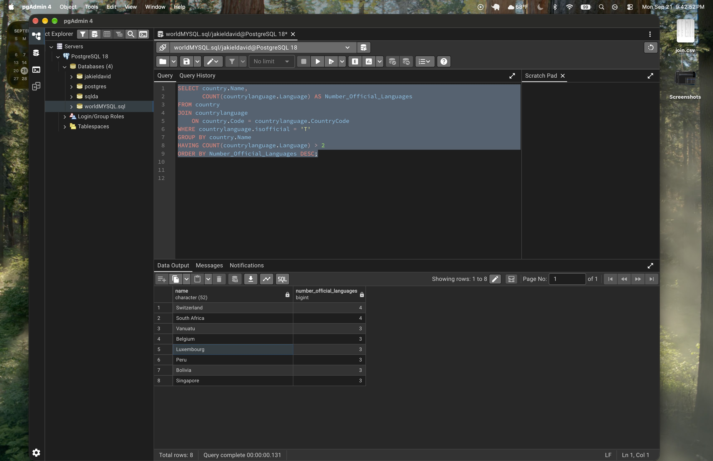
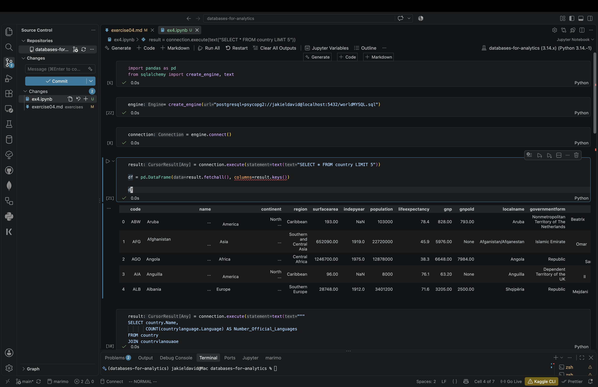
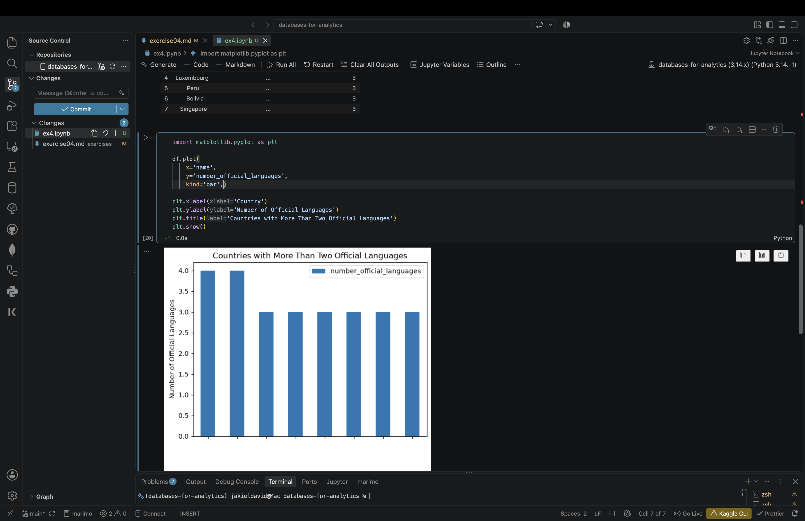

# Exercise 04: Advanced SQL, Jupyter, and Visualization

- Name:Jak
- Course: Database for Analytics
- Module:4
- Database Used: World Database
- Tools Used: PostgreSQL, SQLAlchemy, Pandas, Jupyter Notebooks

---

## Instructions

- Complete each task using the **World database** installed earlier.
- For SQL questions:
  - Write the SQL command in a fenced code block
  - Execute the command and include a **screenshot of the results**
- For Jupyter Notebook questions:
  - Include the required Python statements
  - Include **screenshots of the notebook output**
- Store all screenshots in the `screenshots/` folder and embed them below each question.

---

## Question 1

Considering the World database, write a SQL statement that will
**display the names of countries**
that speak **more than two official languages**,
along with the **number of official languages spoken**.

- Sort the results by **number of languages**, from **most to least**.
- _Hint: There are fewer than 10 countries in the results._

### SQL

```sql
SELECT country.Name,
       COUNT(countrylanguage.Language) AS Number_Official_Languages
FROM country
JOIN countrylanguage
    ON country.Code = countrylanguage.CountryCode
WHERE countrylanguage.isofficial = 'T'
GROUP BY country.Name
HAVING COUNT(countrylanguage.Language) > 2
ORDER BY Number_Official_Languages DESC;

```

### Screenshot



---

## Question 2

Using **Jupyter Notebooks**, you must use the
`create_engine` command to connect to your database.

After the `create_engine` command is executed,
**what are the three statements** required to
execute the query from Question 1 and
**display the results in the notebook**?

### Python Code

```python
connection = engine.connect()

result = connection.execute(text("SELECT * FROM country LIMIT 5"))

df = pd.DataFrame(result.fetchall(), columns=result.keys())

df
```

### Screenshot



---

## Question 3

Using **Jupyter Notebooks**, write the Python code needed
to produce the following graph:


(The graph shows country-level results derived from the World database.)

### Python Code

```python
import matplotlib.pyplot as plt

df.plot(
    x="name",
    y="number_official_languages",
    kind="bar",
)

plt.xlabel("Country")
plt.ylabel("Number of Official Languages")
plt.title("Countries with More Than Two Official Languages")
plt.show()
```

### Screenshot


