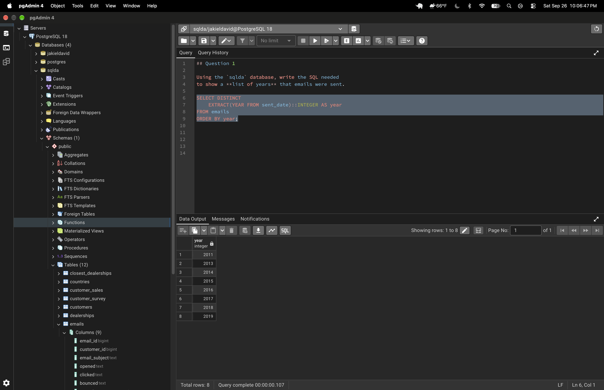
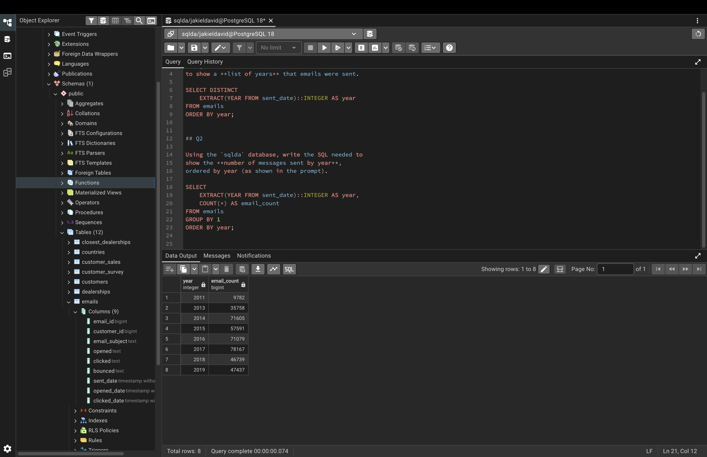
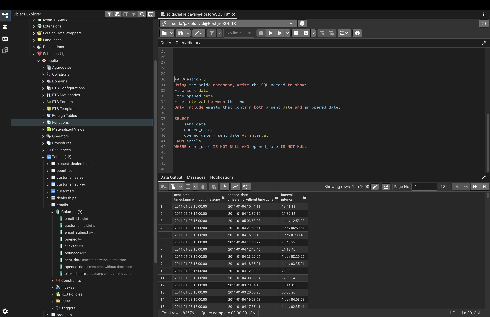
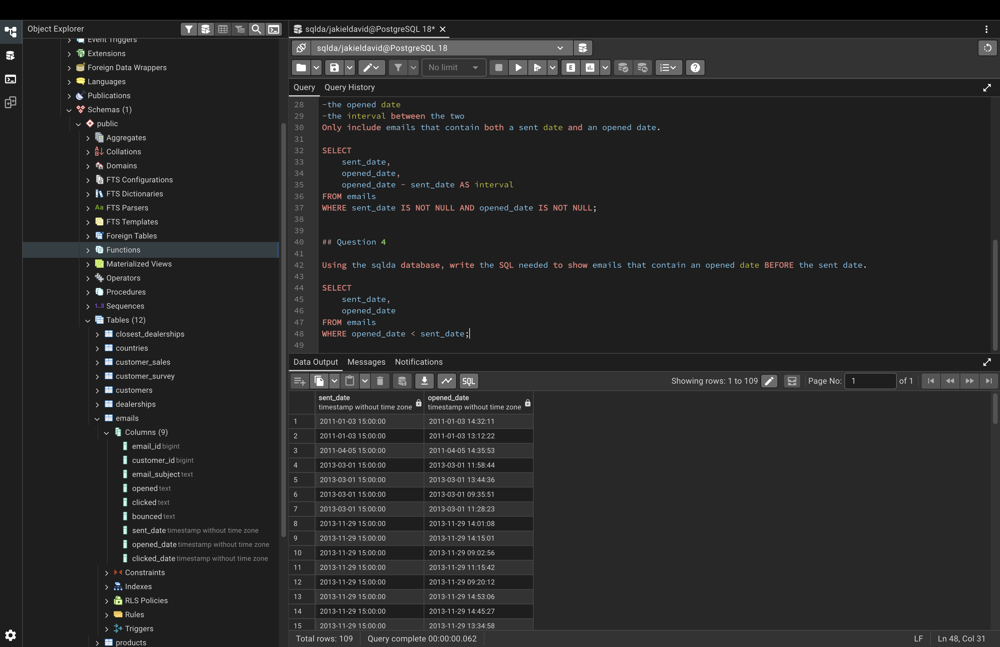
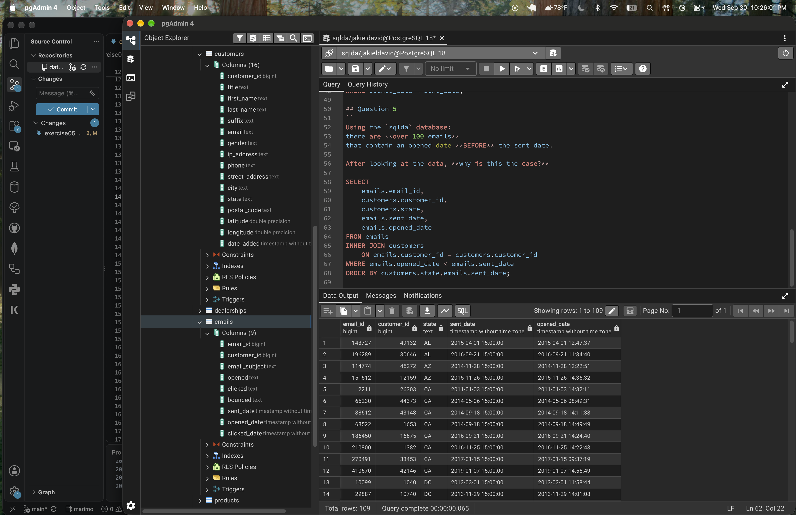
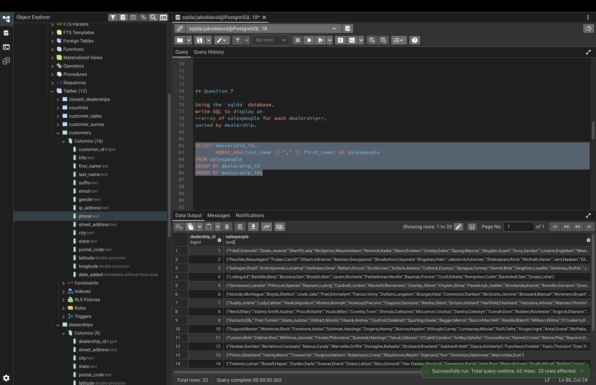
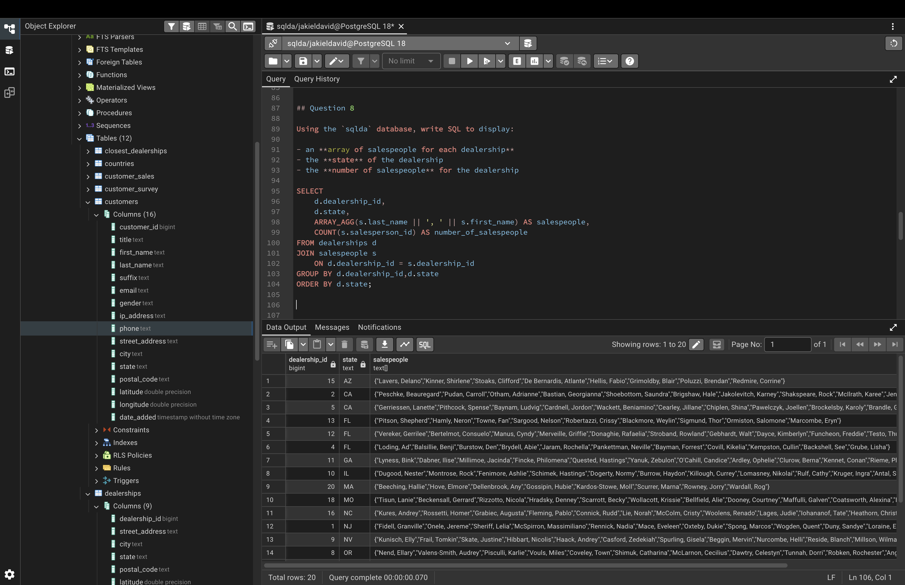
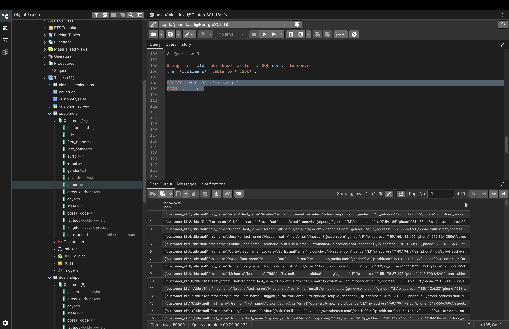
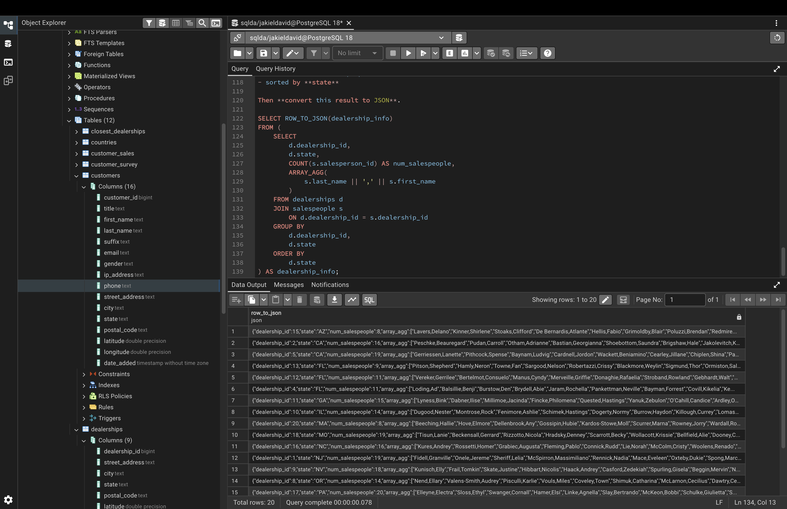

# Exercise 05: SQLDA Database - Dates, Data Quality, Arrays, and JSON

- Name:Jak
- Course: Database for Analytics
- Module:5
- Database Used: `sqlda` (Sample Datasets)
- Tools Used: PostgreSQL (pgAdmin or psql)

---

## Instructions

- Use the **sqlda** database from the "Loading the Sample Datasets" instructions.
- For each SQL task:
  - Include your SQL in a fenced code block
  - Execute it and include a **screenshot** showing the query and results
- Store screenshots in the `screenshots/` folder and embed them below each answer.
- For explanation questions:
  - Write your answer in complete sentences
  - Include a screenshot if requested

---

## Question 1

Using the `sqlda` database, write the SQL needed
to show a **list of years** that emails were sent.
### SQL

```sql
SELECT DISTINCT
    EXTRACT(YEAR FROM sent_date)::INTEGER AS year
FROM emails
ORDER BY year;
```

### Screenshot



---

## Question 2

Using the `sqlda` database, write the SQL needed to
show the **number of messages sent by year**,
ordered by year (as shown in the prompt).

### SQL

```sql
SELECT
    EXTRACT(YEAR FROM sent_date)::INTEGER AS year,
    COUNT(*) AS email_count
FROM emails
GROUP BY 1
ORDER BY year;
```

### Screenshot



---

## Question 3

Using the `sqlda` database, write the SQL needed to show:

- the **sent date**
- the **opened date**
- the **interval** between the two

Only include emails that contain **both** a sent date and an opened date.

### SQL

```sql
SELECT
 	sent_date,
    opened_date,
    opened_date - sent_date AS interval
FROM emails
WHERE sent_date IS NOT NULL AND opened_date IS NOT NULL;
```

### Screenshot



---

## Question 4

Using the `sqlda` database,
write the SQL needed to
show emails that contain an **opened date BEFORE the sent date**.

### SQL

```sql
SELECT
    sent_date,
    opened_date
FROM emails
WHERE opened_date < sent_date;
```

### Screenshot



---

## Question 5

Using the `sqlda` database:
there are **over 100 emails**
that contain an opened date **BEFORE** the sent date.

After looking at the data, **why is this the case?**

### Answer
```sql
SELECT
    e.email_id,
    c.customer_id,
    c.state,
    e.sent_date,
    e.opened_date
FROM emails AS e
INNER JOIN customers AS c
    ON e.customer_id = c.customer_id
WHERE e.opened_date < e.sent_date
ORDER BY e.sent_date;
```

### Screenshot



---

## Question 6

Using the `sqlda` database, explain in your own words what the following code does:

```sql
CREATE TEMP TABLE customer_points AS (
    SELECT
        customer_id,
        point(longitude, latitude) AS lng_lat_point
    FROM customers
    WHERE longitude IS NOT NULL
    AND latitude IS NOT NULL
);

CREATE TEMP TABLE dealership_points AS (
    SELECT
        dealership_id,
        point(longitude, latitude) AS lng_lat_point
    FROM dealerships
);

CREATE TEMP TABLE customer_dealership_distance AS (
    SELECT
       customer_id,
       dealership_id,
       c.lng_lat_point <@> d.lng_lat_point AS distance
    FROM customer_points c
    CROSS JOIN dealership_points d
);
```

### Answer
The query creates three temporary tables to combine customer and dealership locations and calculate the distance between every customer and every dealership using their longitude and latitude.
---

## Question 7

Using the `sqlda` database,
write SQL to display an
**array of salespeople for each dealership**,
sorted by dealership.

### SQL

```sql
SELECT dealership_id,
       ARRAY_AGG(last_name || ',' || first_name) AS salespeople
FROM salespeople
GROUP BY dealership_id
ORDER BY dealership_id;
```

### Screenshot



---

## Question 8

Using the `sqlda` database, write SQL to display:

- an **array of salespeople for each dealership**
- the **state** of the dealership
- the **number of salespeople** for the dealership

Sort by **state**.

Reference image:


### SQL

```sql
SELECT
    d.dealership_id,
    d.state,
    ARRAY_AGG(s.last_name || ', ' || s.first_name) AS salespeople,
    COUNT(s.salesperson_id) AS number_of_salespeople
FROM dealerships d
JOIN salespeople s
    ON d.dealership_id = s.dealership_id
GROUP BY d.dealership_id,d.state
ORDER BY d.state;
```

### Screenshot



---

## Question 9

Using the `sqlda` database, write the SQL needed to convert
the **customers** table to **JSON**.

### SQL

```sql
SELECT ROW_TO_JSON(customers)
FROM customers;
```

### Screenshot



---

## Question 10

Using the `sqlda` database, write SQL to display:

- an **array of salespeople for each dealership**
- the **state**
- the **number of salespeople**
- sorted by **state**

Then **convert this result to JSON**.

Reference image:


### SQL

```sql
SELECT ROW_TO_JSON(dealership_info)
FROM (
    SELECT
        d.dealership_id,
        d.state,
        COUNT(s.salesperson_id) AS num_salespeople,
        ARRAY_AGG(
            s.last_name || ',' || s.first_name
        )
    FROM dealerships d
    JOIN salespeople s
        ON d.dealership_id = s.dealership_id
    GROUP BY
        d.dealership_id,
        d.state
    ORDER BY
        d.state
) AS dealership_info;
```

### Screenshot


